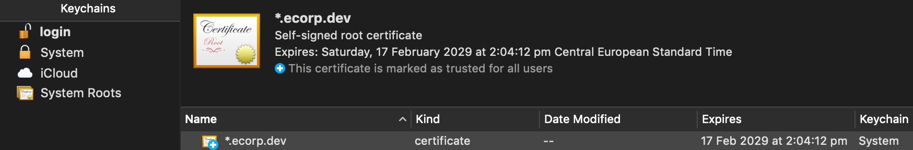

# Welcome to e-corp

## What

[Flood Aqueduct](https://aqueduct.flood.io) helps our customers tunnel from the cloud into their own corporate networks, to facilitate load testing at scale.

For the purposes of testing, you may not always want to target your real life corporate intranet. To that end, this repository provides a very simple, HTTPS based web server which will be reachable only from your own client machine. The configuration is up to you but we recommend hosting this at [www.ecorp.dev](https://www.ecorp.dev)

But wait, before you click that link, you might want to set it up first. Here's how.

## How

First, clone this repository somewhere local so we can get down to business.

### Generate a certificate

You're going to need a self-signed certificate, so you can look and feel like a HTTPS site. If you trust me, run this:

```
	rm -rf ./certs
	mkdir -p ./certs
	openssl req \
    -newkey rsa:2048 \
    -x509 \
    -nodes \
    -keyout ./certs/ecorp.dev.key \
    -new \
    -out ./certs/ecorp.dev.crt \
    -subj /CN=\*.ecorp.dev \
    -reqexts SAN \
    -extensions SAN \
    -config <(cat /System/Library/OpenSSL/openssl.cnf \
        <(printf '[SAN]\nsubjectAltName=DNS:\*.ecorp.dev')) \
    -sha256 \
    -days 3650
```

You should see something like this:

```
Generating a 2048 bit RSA private key
..................+++
.........+++
writing new private key to './certs/ecorp.dev.key'
-----
```

If you didn't, back to google searching you go. Note, these are self signed certificates, no good for production use of course. We only do this so we can pretend to be a real HTTPS based website, in true Mr Robot style.

### Trust yourself

Time to make your shiny new MacBook trust those ~fake~ certificates. To do that, trust me again:

```
  sudo security \
		add-trusted-cert -d \
		-r trustRoot \
		-k /Library/Keychains/System.keychain \
		./certs/ecorp.dev.crt
```

If everything went to plan, your should be able to find your self-signed root certificate for `*.ecorp.dev` sitting in your System Keychain.



### Spin up your web server

Next, you will need [docker compose](https://docs.docker.com/compose/). If you already have docker installed, chances are you already have it, otherwise you can follow its own [installation instructions here](https://docs.docker.com/compose/install/).

Now you're ready to spin up your webserver, do that with this command:

```
  docker-compose up
```

If you do that right, you should see something like this:

```
Recreating ecorpdev_whoami_1    ... done
Starting ecorpdev_nginx-proxy_1 ... done
Attaching to ecorpdev_whoami_1, ecorpdev_nginx-proxy_1
nginx-proxy_1  | Custom dhparam.pem file found, generation skipped
nginx-proxy_1  | forego     | starting dockergen.1 on port 5000
nginx-proxy_1  | forego     | starting nginx.1 on port 5100
whoami_1       | Listening on :8000
nginx-proxy_1  | dockergen.1 | 2019/02/20 13:19:38 Generated '/etc/nginx/conf.d/default.conf' from 2 containers
nginx-proxy_1  | dockergen.1 | 2019/02/20 13:19:38 Running 'nginx -s reload'
nginx-proxy_1  | dockergen.1 | 2019/02/20 13:19:38 Watching docker events
nginx-proxy_1  | dockergen.1 | 2019/02/20 13:19:38 Contents of /etc/nginx/conf.d/default.conf did not change. Skipping notification 'nginx -s reload'
```

Heads up, this thing won't quit until you hit `Ctl-c`. Don't worry, it's meant to be a web server so you want this thing up for your testing ...

### Know how to resolve thyself

The last thing you need to do, is give your machine some way to resolve this fictional site. You can do that in your [hosts](https://en.wikipedia.org/wiki/Hosts_(file)) file.

You want your `/etc/hosts` file to look something like this:

```
##
# Host Database
#
# localhost is used to configure the loopback interface
# when the system is booting.  Do not change this entry.
##
127.0.0.1	localhost
255.255.255.255	broadcasthost
::1             localhost

127.0.0.1       www.ecorp.dev
```

Notice that last line there? It's letting your computer know that the server `www.ecorp.dev` lives on your [localhost](https://en.wikipedia.org/wiki/Localhost) at `127.0.0.1`. If you don't know how to edit these types of files, do so with a a bit of caution. I normally `sudo vi /etc/host` assuming you know how to use [Vi](https://en.wikipedia.org/wiki/Vi). Others prefer [nano](https://en.wikipedia.org/wiki/GNU_nano). Your call, time to learn something new.

### Test thyself

Couple of things you can do now to test it's all hanging together. Running this command:

```
  getent hosts www.ecorp.dev
```

Will hopefully show you that it resolves to this:

```
127.0.0.1       www.ecorp.dev
```

You should also be able to curl yourself:

```
  curl -k https://www.ecorp.dev
```

You'll should get something returned like this:

```
I'm 5400858c7220
```

And last but not least, test it from a browser. Go ahead, click this limk [www.ecorp.dev](https://www.ecorp.dev)

Congratulations if you got this far. If you have questions feel free to reach out to us at Flood.
